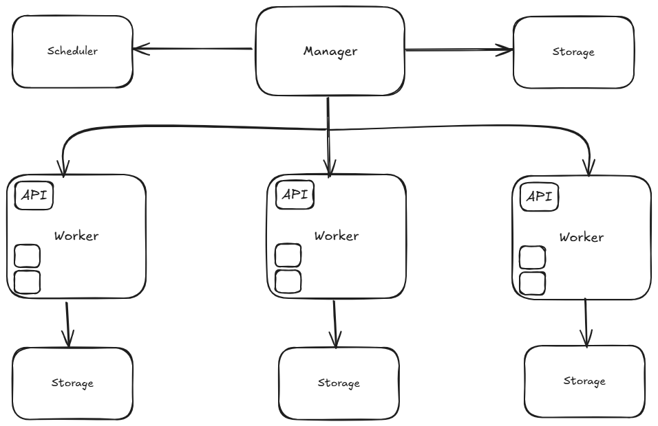
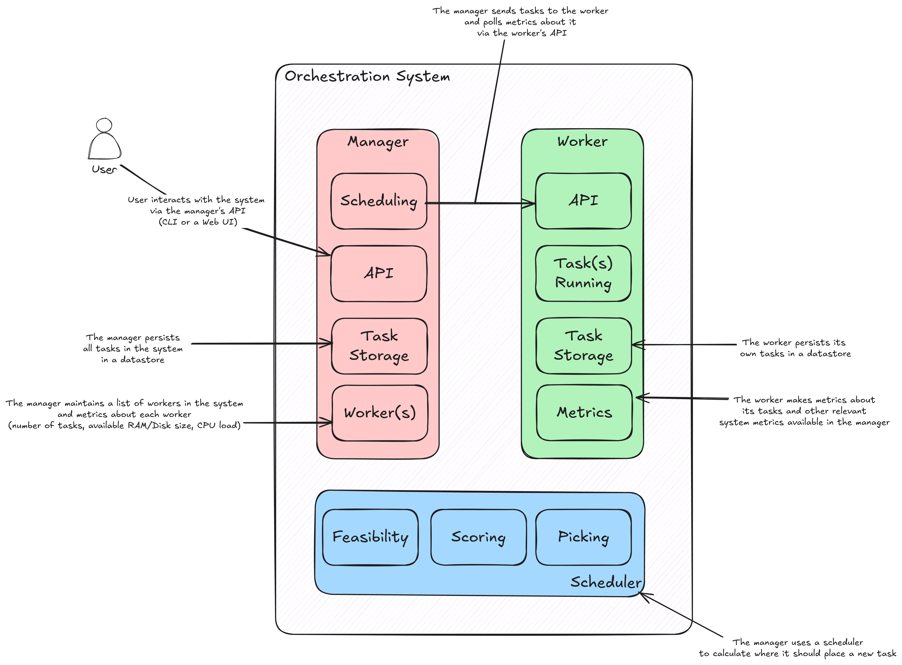

# Cube

## What is an Orchestrator?

An orchestrator is a
system that provides automation for deploying, scaling, and otherwise
managing containers.

## What tools will I use?

To focus on our main goal, we’re going to limit the number of tools and
libraries we use. Here’s the list of tools and libraries we’re going to use:

- Go
- chi
- Docker SDK
- BoltDB
- Linux
- goprocinfo

## The components of an orchestration system

- The task
- The job
- The scheduler
- The manager
- The worker
- The cluster
- The command-line interface (CLI)

Some of these components can be seen here:

## How these components will work together

### The Manager

The manager is the brain of an orchestrator and the main entry point for
users. To run jobs in the orchestration system, users submit their jobs to
the manager. The manager, using the scheduler, then finds a machine
where the job’s tasks can run. The manager also periodically collects
metrics from each of its workers, which are used in the scheduling
process.

The manager should do the following:

1. Accept requests from users to start and stop tasks.
2. Schedule tasks onto worker machines.
3. Keep track of tasks, their states, and the machine on which they run.

### The Task

The task is the smallest unit of work in an orchestration system and
typically runs in a container.

A task should specify the following:

1. The amount of memory, CPU, and disk it needs to run effectively
2. What the orchestrator should do in case of failures, typically called a restart policy
3. The name of the container image used to run the task

### The Job

The job is an aggregation of tasks. It has one or more tasks that typically
form a larger logical grouping of tasks to perform a set of functions.

A job should specify details at a high level and will apply to all tasks it
defines:

1. Each task that makes up the job
2. Which data centers the job should run in
3. How many instances of each task should run
4. The type of the job (should it run continuously or run to completion
   and stop?)

### The Scheduler

The scheduler decides what machine can best host the tasks defined in
the job. The decision-making process can be as simple as selecting a
node from a set of machines in a round-robin fashion or as complex as
the Enhanced Parallel Virtual Machine (E-PVM) scheduler.

The scheduler should perform these functions:

1. Determine a set of candidate machines on which a task could run
2. Score the candidate machines from best to worst
3. Pick the machine with the best score

### The Worker

The worker provides the muscles of an orchestrator. It is responsible for
running the tasks assigned to it by the manager. If a task fails for any
reason, it must attempt to restart the task. The worker also makes
metrics about its tasks and overall machine health available for the
manager to poll.

The worker is responsible for the following:

1. Running tasks as Docker containers
2. Accepting tasks to run from a manager
3. Providing relevant statistics to the manager for the purpose of scheduling tasks
4. Keeping track of its tasks and their states

### The Cluster

The cluster is the logical grouping of all the previous components. An
orchestration cluster could be run from a single physical or virtual
machine. More commonly, however, a cluster is built from multiple
machines, from as few as five to as many as thousands or more.
The cluster is the level at which topics like high availability (HA) and
scalability come into play.

### Command-line Interface

CLI, the main user interface, should allow a user to

1. Start and stop tasks
2. Get the status of tasks
3. See the state of machines (i.e., the workers)
4. Start the manager
5. Start the worker
